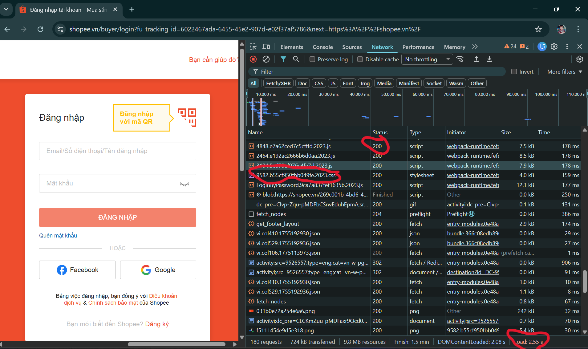

Phần A

Câu A1

Ý 1 (nguồn tham chiếu: 01_introduction_html_universe.md + Cuộc Hành Trình 0.3 Giây Xuyên Đại Dương)

1. Request xuất phát từ laptop -> đi qua router WiFi nhà trọ
2. -> Qua hạ tầng của VNPT -> đi đường cáp quang biển
3. -> Đến Data Center của Shopee ở Jurong, Singapore . Khoảng cách: ~2.800 km.
4. -> Server xử lý: "Mình muốn xem danh sách đồ trong Giỏ hàng"
5. -> Response chạy ngược lại: cáp quang -> VNPT -> router -> laptop
6. -> Chrome nhận file HTML, CSS, JS -> render ra giao diện -> Mình thấy đôi giày mình định mua hiện ra trong giỏ hàng.

Ý 2 (nguồn tham chiếu: 01_introduction_html_universe.md + 4.3.Developer Tools (F12) — "Kính hiển vi" cho website)

- Tab network dùng để xem requests/responses
  
